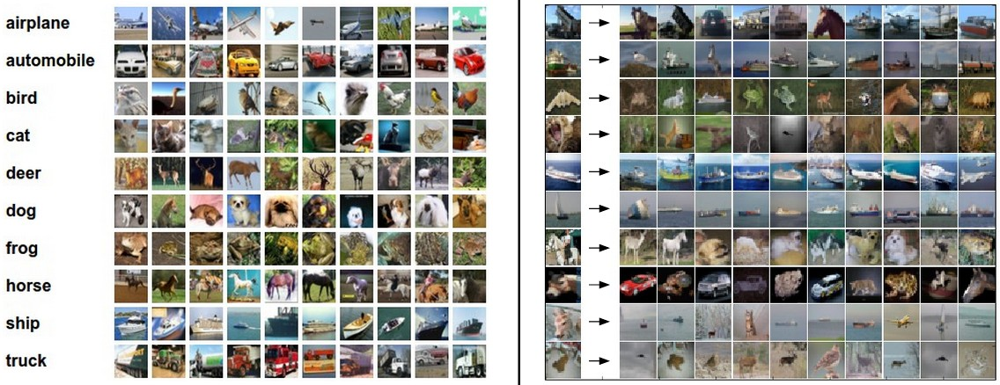
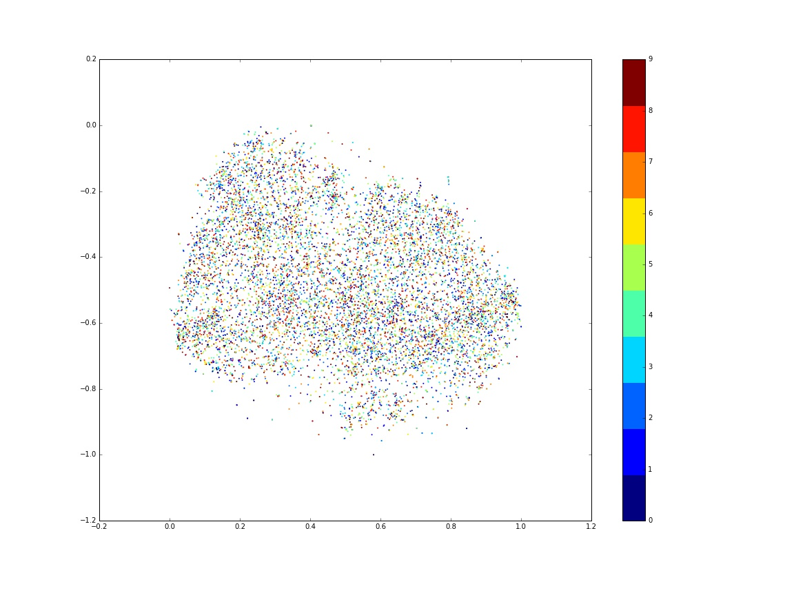
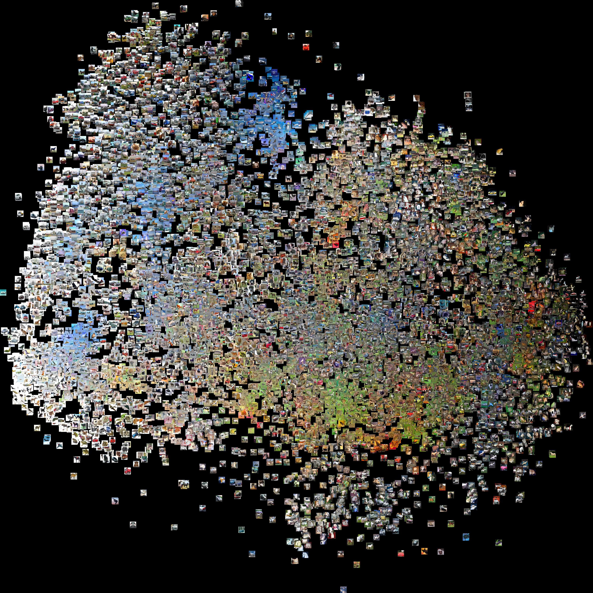
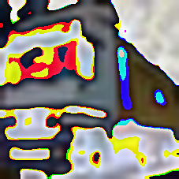
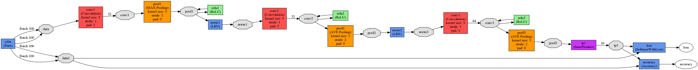
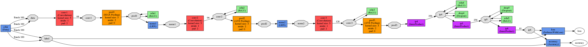
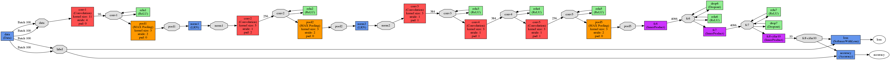
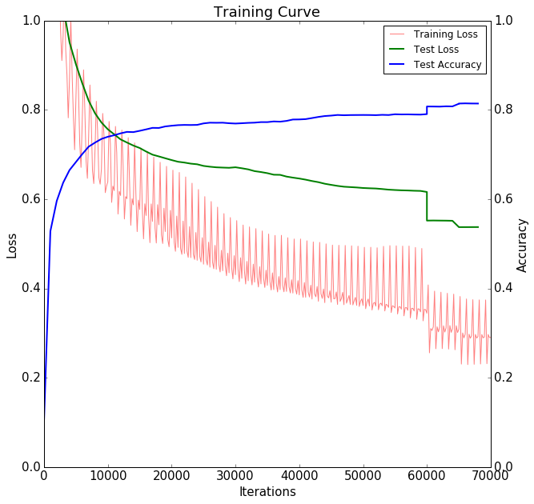
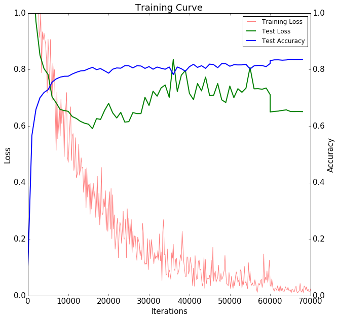
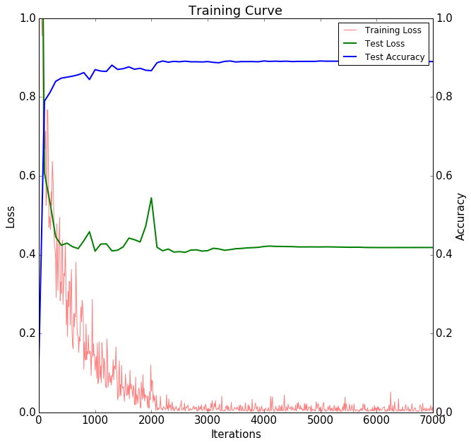

# CIFAR 10 Image Classification with CNN and Caffe
- Machine Learning Engineer Nanodegree Capstone Project
- Neo Xing, 2016/10

## I. Definition

### 1.1 Project Overview
#### Image classification
Computer vision has become the one of the most important field in artificial intelligence as we has entered The Zettabyte Era, where image is the most pervasive form of information. [Cisco]((http://www.cisco.com/c/dam/en/us/solutions/collateral/service-provider/visual-networking-index-vni/complete-white-paper-c11-481360.pdf)) predicated that the global video traffic is 70 percent in 2015 of all consumer Internet traffic.

Image classification, or image recognition, is one core problem in computer vision, which is the task of assigning an input image one label from a fixed set of categories. It has a large variety of practical applications, from post number recognition, facial detection, and researches such as finding new galaxies in astronomy. Moreover, many other computer Vision tasks can be reduced to image classification, such as object detection, segmentation.

 <em>Figure: Image classification task [1]</em>

#### Convolutional Neural Network
Currently, the best algorithms for such tasks are based on convolutional neural networks. Performance of convolutional neural networks, on the ImageNet tests, is now close to that of humans. A convolutional neural network (CNN, or ConvNet) is a type of feed-forward artificial neural network in which the connectivity pattern between its neurons is inspired by the organization of the animal visual cortex.

Convolutional neural networks mitigate the challenges posed by the simple Artificial Neural Network such as MLP by exploiting the strong spatially local correlation present in natural images. It feautures a 3D volumes of neurons of multiple layered structure, especially the convolutional layers with shared local filters and the pooling layers.

The rapid development of CNN lies in the vast utilization of GPU, [large image datasets](https://en.wikipedia.org/wiki/List_of_datasets_for_machine_learning_research#Image_data). There are successful applications in image recognition, natural language processing, and playing [computer Go](https://en.wikipedia.org/wiki/Computer_Go), as well as popular frameworks such as Caffe and Tensorflow.

 <em>Figure: Typical CNN structure, wikipedia Convolution Nerual Network [2]</em>

#### Overview
In this project, we study the CNN based image classification with the famous CIFAR-10 datasets [7](http://www.cs.toronto.edu/~kriz/cifar.html) and Caffe framework. We show how to refine CNN with two optimized methods, the dropout and fine tuning pre-trained network, to achieve the state-of-art accuracy.
We'll start with a more strict definition of the problems and metrics to be studied shortly, following by section 2 the analysis of datasets and CNN algorithms. In section 3, we train the Convnet CNN, focusing on optimization methods such as dropout regularization and parameter fine tuning, and basic transfer learning. In section 4 we provide results of optimized CNN in image classification.

### 1.2 Problem Statement
The problem of image classification is straight forward, given input image, classify it with the most probable category label.

#### Data
We will use CIFAR 10 data sets. It contains 10 categories of small images, 50000 for training and 10000 for testing. The images are randomly shuffled in order and uniformly distributed by categories.

##### CIFAR10 image examples

 <em>Figure CIFAR10 images from 10 categories [1]</em>

##### CIFAR10 image summary

key | meta data
--- | ---
label_names	| [airplane, automobile, bird, cat, deer, dog, f...
num_cases_per_batch	| 10000
num_vis	| 3072

<em>Table: CIFAR10 meta data</em>

test data | batch_label	| data | filenames | labels
--- | --- | --- | --- | ---
0	|testing batch 1 of 1| [158, 159, 165, 166, 160, 156, 162, 159, 158, ...| domestic_cat_s_000907.png| 3
1	|testing batch 1 of 1| [235, 231, 232, 232, 232, 232, 232, 232, 232, ...|	hydrofoil_s_000078.png| 8
2	|testing batch 1 of 1| [158, 158, 139, 132, 166, 182, 187, 193, 199, ...|	sea_boat_s_001456.png| 8
3	|testing batch 1 of 1| [155, 167, 176, 190, 177, 166, 168, 166, 170, ...|	jetliner_s_001705.png| 0
4	|testing batch 1 of 1| [65, 70, 48, 30, 23, 40, 44, 45, 45, 40, 10, 1...|	green_frog_s_001658.png| 6
...	|...	...	...	...
9995 |testing batch 1 of 1|[76, 76, 77, 76, 75, 76, 76, 76, 76, 78, 81, 8...|	cabin_cruiser_s_000783.png| 8
9996 |testing batch 1 of 1|[81, 91, 98, 106, 108, 110, 80, 84, 88, 90, 92...|	tabby_cat_s_000494.png| 3
9997 |testing batch 1 of 1|[20, 19, 15, 15, 14, 13, 12, 11, 10, 9, 8, 8, ...|	pekinese_s_002005.png| 5
9998 |testing batch 1 of 1|[25, 15, 23, 17, 23, 51, 74, 91, 114, 137, 90,...|	convertible_s_002525.png| 1
9999 |testing batch 1 of 1|[73, 98, 99, 77, 59, 146, 214, 176, 125, 218, ...|	broodmare_s_000763.png| 7

<em>Table: CIFAR10 test data</em>

#### Metrics
Two scores are used to evaluate the algorithms, accuracy and loss function. Loss is computed in coorperation with forward feeding of CNN layers. The types of loss function are defined by types and weights in CNN layers. Accuracy is defined by number of true positives divided by total number of testing samples.

## II. Analysis
In this section, we investigate the datasets, CNN algorithms and Caffe framework that we are going to use.

### 2.1 Data
#### Exploration
Each image in CIFAR 10 datasets is a `32px x 32px` RGB image, with one label to be classified. Such small image size implies that it's prone to overfitting, which means that small number of CNN parameters and strong regularization may be needed for better performance.

#### Visualization
To gain a better view of possible patterns in the datasets, we performed a PCA feature exploration, and plotted the 2-D feature map of the 1000 images in data sets.

 <em>Figure: CIFAR10 2D feature maps of 1000 images</em>

We can use a visualization technique called [t-SNE](https://lvdmaaten.github.io/tsne/) to take the CIFAR-10 images and embed them in two dimensions so that their (local) pairwise distances are best preserved, namely the nearby images share more similar features.

 <em>Figure: CIFAR10 2D feature maps of 1000 images embeded </em>

#### Test run on linear classifier
As a introduce, we firstly implemented simple linear classifier using `sklearn`, and run it on testing datasets.
[SGFClasifier](http://scikit-learn.org/stable/modules/generated/sklearn.linear_model.SGDClassifier.html#sklearn.linear_model.SGDClassifier) is a regularized linear models with stochastic gradient descent (SGD) learning with linear SVM loss function. After training the whole datasets, we achieve a test accuracy of 21%. It can be shown that linear classifier, although simple and fast, could not capture most of the patterns in image features, thus failed in most of the classification tasks.

### 2.2 Algorithms and Techniques

#### Multilayer Perceptron using sklearn
We first introduce the Multilayer Perceptron (MLP), a basic nerual network that just consists of fully connected layers.
MLP models does not take into account the spatial structure of data, and the huge number of parameters quickly leads to overfitting. For images with high-dimensional inputs, it is impractical to connect neurons to all neurons in the previous volume because such a network architecture does not take the spatial structure of the data into account.

 <em>Figure: A Neural Network with 2 hidden layers [1]</em>

#### Convolutional Neural Network
A CNN architecture is formed by a stack of distinct layers that transform the input volume into an output volume through a differentiable function. A few distinct types of layers are commonly used.

##### Convolutional layer
The convolutional layer is the core building block of a CNN. The layer's parameters consist of a set of learnable filters or kernels. Stacking the activation maps for all filters along the depth dimension forms the full output volume of the convolution layer. Every entry in the output volume can thus also be interpreted as an output of a neuron that looks at a small region in the input and shares parameters with neurons in the same activation map.

Convolutional networks exploit spatially local correlation by enforcing a local connectivity pattern between neurons of adjacent layers: each neuron is connected to only a small region of the input volume. Such an architecture ensures that the learnt filters produce the strongest response to a spatially local input pattern.

Parameter sharing scheme is used in convolutional layers to control the number of free parameters. It relies on one reasonable assumption: if one patch feature is useful to compute at some spatial position, then it should also be useful to compute at a different position. Therefore, it is common to refer to the sets of weights as a filter (or a kernel), which is convolved with the input. The result of this convolution is an activation map, and the set of activation maps for each different filter are stacked together along the depth dimension to produce the output volume.

 <em>Figure: LeNet CNN structure [6]</em>

##### Pooling layer
Another important concept of CNNs is pooling, which is a form of non-linear down-sampling. The function of the pooling layer is to progressively reduce the spatial size of the representation to reduce the amount of parameters and computation in the network, and hence to also control overfitting.

The pooling layer operates independently on every depth slice of the input and resizes it spatially. The most common form is a pooling layer with filters of size 2x2 applied with a stride of 2 max pooling. Every MAX operation would in this case be taking a max over 4 numbers, discarding 75% of the data.

##### Activation layer
Activation layer is used to ...
ReLU is the abbreviation of Rectified Linear Units. This is a layer of neurons that applies the non-saturating activation function `f(x)=max(0, x)`. It increases the nonlinear properties of the decision function and of the overall network without affecting the receptive fields of the convolution layer.

##### Fully connected layer
After several convolutional and max pooling layers, the high-level reasoning in the neural network is done via fully connected layers. Neurons in a fully connected layer have full connections to all activations in the previous layer, as seen in regular Neural Networks. Their activations can hence be computed with a matrix multiplication followed by a bias offset.

##### Loss layer
The loss layer specifies how the network training penalizes the deviation between the predicted and true labels and is normally the last layer in the network. In our study, softmax loss is used for predicting a single class of K mutually exclusive classes.

#### Droput layer
Dropout is an extremely effective, simple and recently introduced regularization technique by Srivastava that complements the other methods (L1, L2, maxnorm). While training, dropout is implemented by only keeping a neuron active with some probability, or setting it to zero otherwise.

 <em>Figure: Dropout Neural Net Model</em>

#### Caffe
Caffe is a deep learning framework made with expression, speed, and modularity in mind.[[Caffe]](http://caffe.berkeleyvision.org/) It features easy defining nets, high speed GPU computation, and lots of open source community support such as shared models.

##### Defining layers
Caffe defines a net layer-by-layer in its own model schema. The network defines the entire model bottom-to-top from input data to loss. As data and derivatives flow through the network in the forward and backward passes Caffe stores, communicates, and manipulates the information as blobs: the blob is the standard array and unified memory interface for the framework. The layer comes next as the foundation of both model and computation. The net follows as the collection and connection of layers.
To create a Caffe model we need to define the model architecture in a protocol buffer definition file (prototxt). The layers we will use are Convolution, Polling, Softmax, ReLU, Inner Product (Fully Connected) and Dropout layers.

##### Defining solvers
The solver orchestrates model optimization by coordinating the network’s forward inference and backward gradients to form parameter updates that attempt to improve the loss. The responsibilities of learning are divided between the Solver for overseeing the optimization and generating parameter updates and the Net for yielding loss and gradients.
We will use the default solver Stochastic Gradient Descent, tuning the hyperparameters learning rate α, momentum μ, and learning policy and steps.

##### Defining models
The models are defined in plaintext protocol buffer schema (`prototxt`) while the learned models are serialized as binary protocol buffer `.caffemodel` files following Google Protocol Buffer. It enables us to directly load and fine tune a pretrained CNN, which will greatly reduce the training cost and improve efficiency.
We will use the [Caffenet](https://github.com/BVLC/caffe/tree/master/models/bvlc_reference_caffenet) model comes with [Caffe Model Zoo](https://github.com/BVLC/caffe/wiki/Model-Zoo) framework of Caffe.

#### Environment
The study of this problem is performed on a Ubuntu 14.04 GPU instance of AWS EC2, with NVIDIA CUDA 7.5 and Caffe.

## III. Methodology
In this section, we show the process of trainning CNN with Caffe. We'll highlight how to improve CNN performance with two optimized technology, namely the dropout and fine tuning.

### 3.1 Data Preprocessing
To improve the performance of file IO and memory access, Caffe load data from database and compute data in binary blobs. We will need to convert pickled CIFAR10 python batch to `leveldb`.

It's important to do center the images by mean subtraction, which will be handled by Caffe scripts.

For fine tuning the Caffenet, we will need to resize CIFAR10 `32*32` image to `227*227` images, then convert and save them to database.

<table width="500px" height="100%" border="0">

<tr>
<td>

</td>

<td>

</td>

<td>

</td>
</tr>

</table>
<em>Figure: CIFAR10 data mean subtraction  
a) CIFAR10 Caffenet mean image; b) CIFAR10 Caffenet image "truck"; c) CIFAR10 Caffenet image "truck" centered
</em>

 

Caffe data augmentation can be performed on the fly automatically in data layer. However, this method is not used as its improvement to CIFAR 10 should be small due to its small amount of features and labels.

### 3.2 Implementation
#### Convnet
We will start with [Caffe implmentation](http://caffe.berkeleyvision.org/gathered/examples/cifar10.html) of Alex Krizhevsky’s cuda-convnet.

 <em>Figure: CIFAR10 Convnet diagram</em>

#### CNN with dropout
For CNN with dropout, we will add two more FC layers after the FC layer in Convnet, each of them is followed by a ReLU activation layer and dropout layer.
To utilize the strong regularation of the dropout layers, we increase the depth (`num_output`) of Conv layers and FC layers to enable the net to capture more features and patterns.

 <em>Figure: CIFAR10 CNN with dropout diagram</em>

#### Caffenet fine tuning
To fine tune pre-trained Caffenet, we will modify its net strucutre and solver.
For CNN net prototxt, the name of last FC layer is changed to avoid using Caffenet weights, its output depth is set to the number of CIFAR labels. The database sources are modified accordingly.
For solver protoxt, we load the weights of Caffenet model, and decrease its base learning rate as the pre-trained model should already have good performance on new datasets.
We also make some modification due to computation consideration, for example, using a subset of CIFAR10 (10k training images, 2k testing images), smaller data batch size and less training iteration.

 <em>Figure: CIFAR10 Caffenet fine-tuning diagram</em>

## IV. Results
In this section, we study the results of three CNN models that we have trained.

### Model Evaluation
Original Convnet is pretty straightforward, it works pretty well for CIFAR10 with small image size. However, the tuning of the multisteps learning rate is effective yet difficult.

 <em>Figure: CIFAR10 Convnet learning curve</em>

By adding simple dropout layers and more depth to data blobs, CNN with dropout gains ability to capture more patterns with overfitting restricted by extra regularization.

 <em>Figure: CIFAR10 Convnet learning curve</em>

Using fine-tuned Caffenet and the pre-trained weights, we achive good scores of accuracy at the initial and final steps of training. It shows most of the patterns in different images can be captrued using the same network.

 <em>Figure: CIFAR10 Caffenet fine-tuning learning curve</em>

## V. Conclusion
We have shown how to train CNN for image classification tasks, moreover, how to refine CNN models by dropout layers and fine tuning pre-trained models. Our training accuracy improves from 81% to 83.55% and 89%, giving good performance for CIFAR 10 datasets.

There are two challenges during the project, the complication nature of CNN and the high demand of CNN training in computing power and time. The optimization of CNN hyperparameters are hard due to large number of parameters and difficulty in interpretation of their mechanism. The cost of CNN training is high for large datasets, it usually takes hours running on latest GPUs. Using cloud computing may help to alleviate the long training circle.

Despite the challenges, image classification with CNN is promising for the rapid development in hardware, software, and industry applications. Thus future work on these tasks are attracting, such as performing transferred learning on general datasets, and migrating CNN on cloud platform such as TensorFlow.

### Reference
[1]: [CS231n Convolutional Neural Networks for Visual Recognition
](http://cs231n.github.io/)

[2]: [Wikipedia: Convolutional neural network](https://en.wikipedia.org/wiki/Convolutional_neural_network)

[3]: [ConvNet by Alex Krizhevsky](https://code.google.com/p/cuda-convnet/)

[4]: [Dropout: A Simple Way to Prevent Neural Networks from Overfitting](http://www.cs.toronto.edu/~rsalakhu/papers/srivastava14a.pdf)

[5]: [AlexNet: ImageNet Classification with Deep Convolutional Neural Networks](http://papers.nips.cc/paper/4824-imagenet-classification-with-deep-convolutional-neural-networks)

[6]: [Y. LeCun, L. Bottou, Y. Bengio, and P. Haffner. Gradient-based learning applied to document recognition](http://yann.lecun.com/exdb/publis/pdf/lecun-01a.pdf)

[7]: [CIFAR10: Learning Multiple Layers of Features from Tiny Images, Alex Krizhevsky, 2009](http://www.cs.toronto.edu/~kriz/learning-features-2009-TR.pdf)
